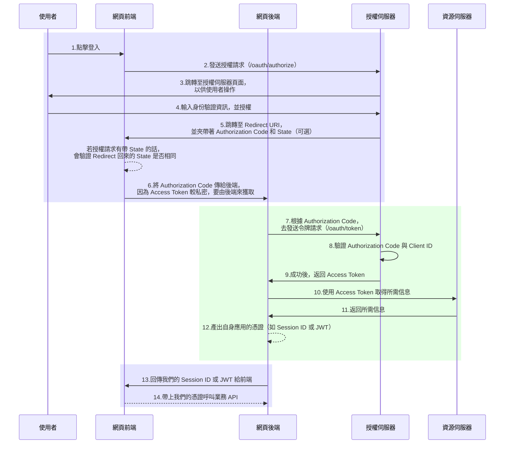

# google-oauth-demo

## 如何啟用此專案？
1. 準備好 Docker 環境

   專案中已有定義好各自的 Dockerfile 與 docker-compose.yaml，供大家即開即用，所以要先準備好你的 Docker 環境。
   
2. 到 Google OAuth 註冊你的應用

   會需要你們先到 [Google Cloud Console](https://console.developers.google.com/) 上建立屬於自己的 OAuth 2.0 憑證。  
   從「API 和服務」->「憑證」->「+建立憑證」->「OAuth 用戶端 ID」去建立屬於自己的 OAuth 2.0 憑證。
   - 應用程式類型填「網頁應用程式」
   - 名稱隨便你填
   - 已授權的 JavaScript 來源填「http://localhost:3000」
   - 已授權的重新導向 URI 填「http://localhost:3000/callback」
    
   建立完後，就能在頁面右半部找到屬於你的「用戶端編號（CLIENT_ID）」和「用戶端密鑰（CLIENT_SECRET）」。

3. 將 CLIENT_ID 和 CLIENT_SECRET 填到專案中

   前端只要填 CLIENT_ID，搜尋一下 googleClientId 關鍵字，並將它改成你的 ID 即可。  
   後端則是使用 .env 文件來管理，首先先將 backend 目錄下的 .env.sample 改名為 .env，然後填寫其中的 GOOGLE_CLIENT_ID 與 GOOGLE_CLIENT_SECRET 即可。

4. 啟動專案

   在專案根目錄中，執行 `docker compose up` 即可。

5. 測試網站

   打開瀏覽器並前往 `http://localhost:3000/`，就可以開始 Demo 了。

## OAuth 流程圖

